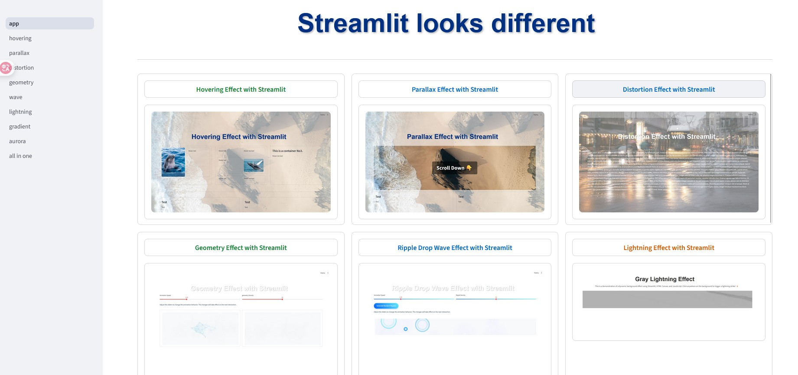

# Streamlit looks different

Streamlit is an open-source framework for building data-driven dashboards and web applications with ease. With just a few lines of Python, you can create beautiful, interactive, and intuitive UIs—perfect for machine learning projects, data science workflows, or rapid prototyping.

🐬 **Main Features**
- hovering effect
- parallax effect
- distortion effect
- geometry effect
- ripple drop wave effect
- lightning effect
- background gradient effect
- aurora effect
- random floating word effect

✨ **Why Streamlit?**

- From Simple Code → Powerful UI
   - Build interactive dashboards, forms, and visualizations with minimal Python code.
   - No need to dive into complex HTML/CSS/JS.

- Fast Prototyping
   - Instantly visualize ideas and models.
   - Share results seamlessly with teammates or clients.

- Data-Centric by Design
   - Fully compatible with popular libraries like Pandas, Matplotlib, Plotly, and Altair.
   - Supports real-time updates and live data streams.

🎨 **Beautiful & Flexible Design**

Streamlit is more than just a data visualization tool.
It empowers you to craft modern, elegant, and flexible interfaces with ease.
You can make it look different with your original idea.

- Sophisticated Layouts
  - Use st.columns, st.container, and st.expander to build clean, responsive layouts. (supporting Flex layout in verson 1.48.0)
- Custom Styling with CSS & HTML
  - Style default widgets or extend UI with HTML/CSS.
  - Create trendy effects like Glassmorphism, Parallax, or hover animations.
- Responsive Interfaces
  - Adapts smoothly across desktops, tablets, and mobile devices.

I hope you to have nice and efficient idea for streamlit ui. Bye.

